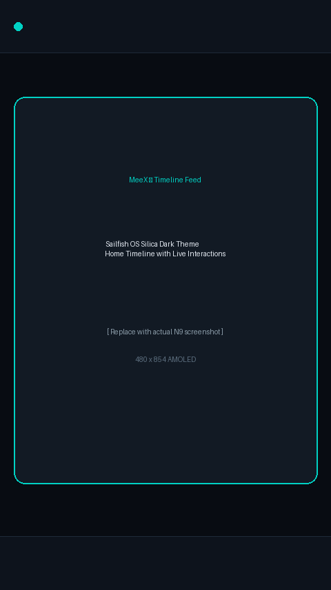
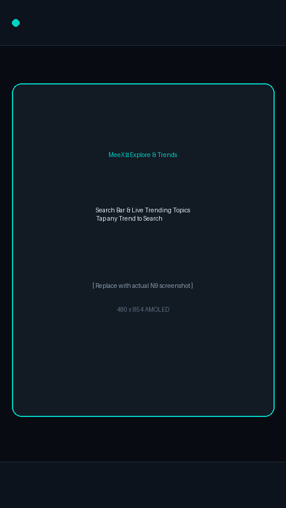
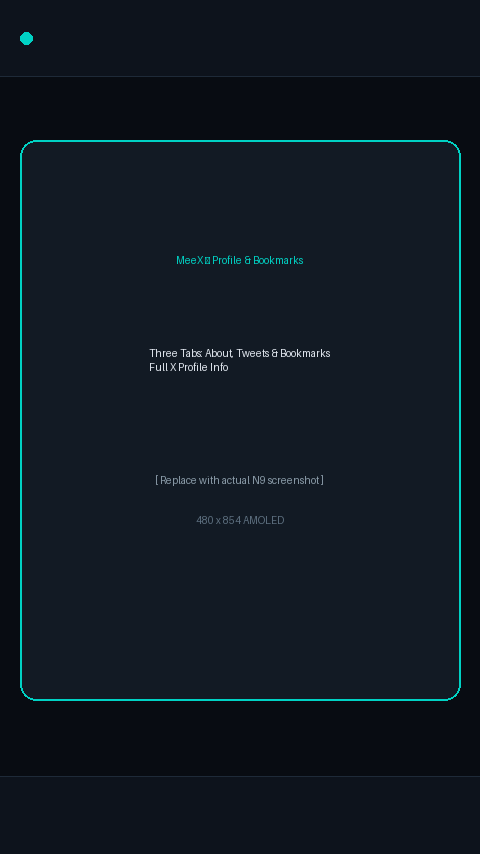
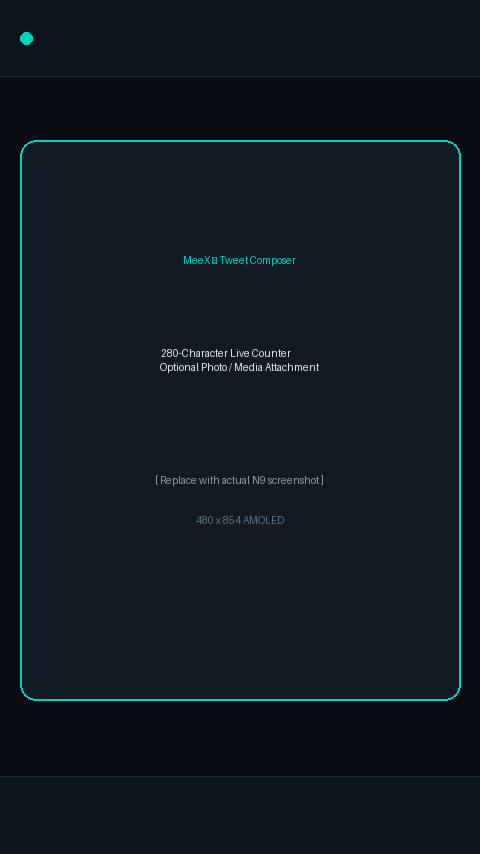
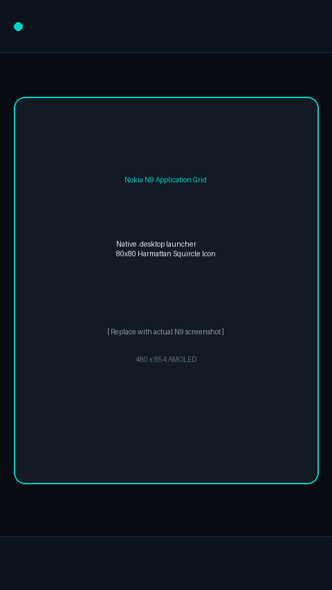

# MeeX — X (Twitter) Client for Nokia N9

[](LICENSE)
[](https://en.wikipedia.org/wiki/MeeGo)
[](https://sailfishos.org/)
[](https://www.python.org/)

**MeeX** is an open-source, modern X (Twitter) client designed specifically for the legendary **Nokia N9 (MeeGo 1.2 Harmattan)** smartphone.

It bypasses official paid X API paywalls and outdated phone TLS/SSL cipher limitations by utilizing a lightweight Python bridge server that speaks directly to X's Web GraphQL endpoints using your browser session cookies.

---

*For the Turkish documentation, please see [README_TR.md](README_TR.md).*

---

## 📸 Screenshots

| Timeline Feed | Explore & Trends | Tweet Detail & Replies |
|:---:|:---:|:---:|
|  |  |  |

| Profile & Bookmarks | Compose Tweet | Application Grid |
|:---:|:---:|:---:|
|  |  |  |

---

## ✨ Features

- **Sailfish OS (Silica UI) Aesthetic:**
  - Ambient deep OLED black theme (`#080C12`) tailored for the Nokia N9 AMOLED display.
  - Translucent glassmorphism tweet cards with rounded corners.
  - Interactive **Pulley Menu** (*Pull down to refresh / release*).
  - Sailfish turquoise (`#00D2C4`), heart pink (`#FF3366`), retweet green (`#00E676`), and bookmark amber (`#F59E0B`) accents.
  - Instant on-screen **Sailfish Toast Notification Capsules** on action feedback.
- **Rich Interaction & Actions:**
  - **Timeline Feed:** View latest tweets with author names, handles, timestamps, and formatted text.
  - **Interactive Action Pills:** One-tap toggle for **Like / Unlike** (♥), **Retweet / Unretweet** (⇄), and **Bookmark / Unbookmark** (★) with live counters.
  - **Fast Reply:** Tap "Reply" (↩) to open the composer with pre-filled `@username`.
  - **New Tweet Composer:** Built-in 280-character live counter pill plus optional **Photo / Media attachment** field (📷).
- **Search & Trending Topics (Keşfet):**
  - Instant search with keyboard support for tweets, hashtags, and keywords.
  - Live trending topics with tweet volume badges; tap any trend to search instantly.
- **Tweet Detail & Conversation Thread:**
  - Full-size tweet view with replies thread listed beneath the parent tweet.
- **Profile Page with Bookmarks:**
  - Three-tab layout on user's profile:
    - **About:** Banner, circular Avatar, Bio, Location, Join Date, Follower/Following stats.
    - **Tweets:** Scrollable list of the user's recent posts.
    - **Bookmarks:** Access all your saved X bookmarks directly on your N9.
  - Tap any user's avatar or name in the timeline to view their profile.
- **Native MeeGo Harmattan Integration:**
  - **System App Launcher:** Native `.desktop` entry and 80x80 Harmattan squircle icon (`meex.png`).
  - **One-Command Over-the-Air (OTA) Installer:** Easily install directly from the bridge server via `wget`.
  - **Offline SQLite Caching:** Uses built-in QML WebSQL/SQLite to cache your timeline so you can read tweets even when disconnected from Wi-Fi.
- **Under-the-Hood Fixes:**
  - **Image & Avatar Proxy:** Proxies images and avatars over local HTTP, bypassing outdated N9 SSL handshake errors.
  - **Nokia N9 Emoji Sanitizer:** Maps modern emojis to clean symbols and ASCII smileys (`♥`, `:D`, `[Alev]`), preventing broken tofu square glyphs (`□`) on older fonts.
  - **Webpack Regex Patch:** In-memory monkey patch fixing X's dynamic `ondemand.s.js` `x-client-transaction-id` token extraction.

---

## 🏗️ Architecture

```
[ Nokia N9 (MeeGo Harmattan) ]
      │  (QtQuick 1.1 / PySide / QML)
      ▼  HTTP REST requests (Local Wi-Fi)
[ MeeX.py Bridge Server ] (Running on PC / Home Server / Raspberry Pi)
      │  TLS 1.3 / Twikit / GraphQL
      ▼  Authenticated via browser session cookies
[ X (Twitter) Servers ]
```

---

## 🚀 Getting Started

### 1. Server Setup (PC / Server)

Requirements: Python 3.10 or higher.

1. **Install Dependencies:**
   ```bash
   pip install -r requirements.txt
   ```

2. **Configure Your Session Cookies:**
   Log in to [x.com](https://x.com) in your desktop browser:
   - Press `F12` to open Developer Tools.
   - Go to **Application** (or **Storage**) > **Cookies** > `https://x.com`.
   - Copy the value of **`auth_token`** (approx. 40 characters).
   - Copy the value of **`ct0`** (CSRF token, approx. 160 characters).

3. Create `cookies.json` (copy from `cookies.json.example`):
   ```json
   {
     "auth_token": "YOUR_AUTH_TOKEN_HERE",
     "ct0": "YOUR_CT0_HERE",
     "username": "YOUR_USERNAME_HERE"
   }
   ```
   *(Alternatively, set `X_AUTH_TOKEN`, `X_CT0`, and `X_USERNAME` environment variables).*

4. **Start the Server:**
   - **Windows:** Double-click `start.bat` or run:
     ```cmd
     python MeeX.py
     ```
   - **Linux / macOS:**
     ```bash
     python3 MeeX.py
     ```
   Note the local IP address shown in the console (e.g. `http://192.168.1.100:5000`).

---

### 2. Nokia N9 Setup

#### Option A: Over-The-Air (OTA) Automatic Install (Recommended)
While your server is running on your PC (e.g., `192.168.1.100:5000`), open Terminal on your Nokia N9 as root (`devel-su`, password: `rootme`) and run:
```bash
wget -qO- http://<PC_IP>:5000/install | sh
```
*(Replace `<PC_IP>` with your computer's local IP address).*

#### Option B: Transfer via SCP
From your PC (PowerShell or Bash):
```bash
scp -O -oHostKeyAlgorithms=+ssh-rsa main.qml run.py meex.png meex.desktop user@<PHONE_IP>:/home/user/
```
Then on the Nokia N9 Terminal (as root):
```bash
mkdir -p /opt/MeeX /usr/share/applications /usr/share/icons/hicolor/80x80/apps
cp /home/user/main.qml /opt/MeeX/
cp /home/user/run.py /opt/MeeX/ && chmod +x /opt/MeeX/run.py
cp /home/user/meex.png /usr/share/icons/hicolor/80x80/apps/
cp /home/user/meex.desktop /usr/share/applications/
```

5. Once MeeX opens, tap the **Settings (⚙)** icon on the bottom dock, enter your server IP address (e.g. `http://192.168.1.100:5000/api`), and tap **Save & Update**.

---

## 📁 Repository Structure

```
├── MeeX.py               # Python bridge server (Flask + Twikit + Image Proxy)
├── main.qml              # Sailfish OS Silica QML interface for Nokia N9
├── meex.png              # 80x80 MeeGo Harmattan squircle application icon
├── meex.desktop          # MeeGo Harmattan desktop launcher
├── install_n9.sh         # One-command Nokia N9 native app installer
├── run.py                # Standalone Nokia N9 PySide launcher
├── start.bat             # One-click starter script for Windows
├── requirements.txt      # Python dependencies
├── cookies.json.example  # Session cookies template (no credentials stored)
├── meex_1.0.0_armel.deb  # Pre-compiled Nokia N9 Debian package
├── screenshots/          # Application screenshots directory
│   ├── README.md         # Guide for capturing N9 screenshots
│   ├── 01_timeline.png
│   ├── 02_explore_trends.png
│   ├── 03_tweet_detail.png
│   ├── 04_profile_bookmarks.png
│   ├── 05_compose_tweet.png
│   └── 06_nokia_n9_app_grid.png
├── .gitignore            # Git ignore file (prevents leaking cookies.json)
├── LICENSE               # MIT License
├── README.md             # English documentation
└── README_TR.md          # Turkish documentation
```

---

## 📄 License

This project is licensed under the MIT License — see the [LICENSE](LICENSE) file for details.
